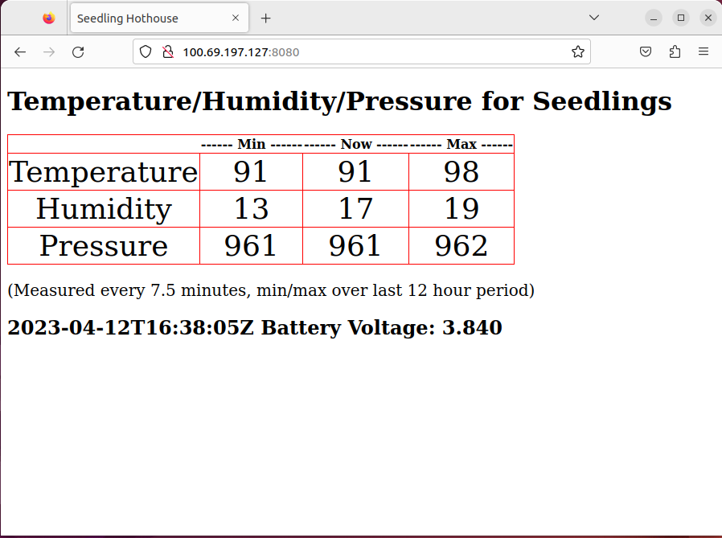

# Trivial File Transfer Protocol

This is an implementation of [RFC 1350](https://www.rfc-editor.org/rfc/rfc1350).  
It has been tested against a [TFTP-GO](https://github.com/lfkeitel/tftp-go) server.  

### Running the code
1. Run the TFTP-GO server.  It runs fine on a Raspberry Pi, the command below instructs the code to run as a server, serving files out of the `../assets` directory and allowing files to be overwritten (great to testing).  
    `sudo ./tftp-go -root ../assets -ow -server`
2. From the examples directory (after adjusting the server address `SERVER` appropriately), run:  
    `jag run -d host client_write.toit` to create files at the server, with the nominated names.
3. To run the example in `example_seedlings`, change to that directory:
    - Setup an [Artemis](https://github.com/toitware/artemis-releases) node, then:
    - `make clean`
    - `make`
    - `artemis device update --specification device.json`
    - setup a webserver to serve the `assets` directory on the Pi, then point a browser at the served `index.html` page.  ([Tailscale](https://tailscale.com/) is very useful for providing a secure, static IP for your server)
    - you should see something like:  

